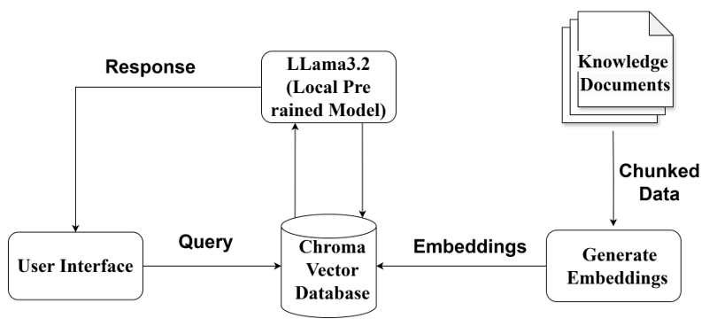

<h1>Welcome to Network Security Bot</h1>
<h2> Project Description </h2>

This project develops an interactive quiz bot aimed at enhancing learning in network security. It features a user- friendly interface for seamless interaction, an Embedding Model to convert text into vectors for efficient comparison, and a Vector Database (Chroma DB) to match similar knowledge documents. The bot uses Large Language Models (LLM) to process user inputs and generate accurate, contextual responses. Drawing from various sources such as textbooks, lecture slides, and online materials, the system provides personalized feedback, correct answers, and citations, ensuring an engaging and effective learning experience in network security.. The quiz includes multiple-choice questions, true/false questions, and open-ended questions. Finally, the bot will provide feedback on the user's answers if it is correct or not along with the reference source documentation title.

<h2> System Architecture </h2>

  

  <h4>User Input:</h4>
  The user enters a prompt in the user interface.
  <h4>Embedding Generation:</h4>
  The system converts user queries into numerical embeddings, capturing the meaning of the text.
  <h4>Vector Database Query:</h4>
  The application sends the generated embedding to the vector database. 
  The vector database compares the user's embedding with precomputed embeddings of various documents. 
  It returns a list of documents that are most relevant to the user's prompt based on the similarity of their embeddings to the user's embedding.
  <h4>Contextual Prompt Creation:</h4>
  The application creates a new prompt by combining the user's initial prompt with the retrieved documents as context. 
  This step aims to provide additional information and context to the local Language Model.
  <h4>Local Language Model Processing (LLM):</h4>
  The modified prompt, containing both the user's input and relevant context documents, is sent to the local Language Model (LLM). 
  The LLM processes the contextual prompt and generates a response based on the combined information. 
  The response includes citations or references from the context documents, demonstrating the sources used to generate the answer.
  <h4>User Interface Display:</h4>
  The system presents the response along with citations in the user interface. 
  Users can view the answer and sources, ensuring transparency and credibility in the information provided.

<h2> Video </h2> 
<video width="320" height="240" controls>
  <source src="movie.mp4" type="QuizBot_Video.mp4">
  Your browser does not support the video tag.
</video>

<h2> Prerequisite </h2>
Install python3 
Create virtual environment 
python3 -m venv venv 
./venv/bin/activate - for MAC users 
./venv/Scripts/activate - for WINDOWS users 
<h2> Requirements </h2>
*pip install langchain==0.0.274 
*pip install gpt4all==1.0.8 
*pip install chromadb==0.4.7 
*pip install llama-cpp-python==0.1.81 
*pip install urllib3==2.0.4  
*pip install PyMuPDF==1.23.1  
*pip install python-dotenv==1.0.0  
*pip install unstructured==0.10.8  
*pip install extract-msg==0.45.0 
*pip install tabulate==0.9.0 
*pip install pandoc==2.3  
*pip install pypandoc==1.11  
*pip install pypdfcd 
*pip install tqdm==4.66.1 
*pip install sentence_transformers==2.2.2  
*pip install flask
   
<h2> Step by step instructions for executions </h2>

Step 1: Clone the repo 
git clone https://github/com/nlyson/CS5342Project

Step 2: Create virtual environment
python3 -m venv venv

Step 3: Install dependencies
pip install -r requirements.txt

Step 4: Pull the model (make sure you have ollama running... Google 'how to run ollama locally' for help)
ollama pull llama3.2

Step 5: Open VS Code
code .

Step 6: Open the src/llama_train.ipynb notebook

Step 7: Run 'Dependencies' cell.

Step 8: Run 'Embed Documents' cell.  (use vectorstore = Chroma.from_documents(persist_directory=<path_to_local_dir>, documents=splits, embedding=embeddings) if you want to save your embeddings locally.

Step 9: Run 'Initialize Llama locally' cell.

Step 10: Run 'Generate prompt with GUI using gradio' cell.

Step 11: Broswe to http://127.0.0.1:7862 in your browser.

Step 12: In the text box, enter one of the following:
1) Generate a multiple choice network security question and provide feedback to my answer.
2) Generate a true/false network security question and provide feedback to my answer.
3) Generate a short answer network security question and provide feedback to my answer.

Step 13: You can also be creative. Try telling the Chatbot to give you questions, grade them, and give you feedback.

<h2>Identifying issues and Implementing Solutions</h2>

  Issue 1: We initially embedded and stored the preprocessed documents into a vector database. We used similar matching to retrieve the results, but the results didn’t come in question/answer format.
  Solution 1: We augment the results with the llama3.2 model. We were able to augment results with generated content.

  Issue 2: After giving questions and answers, the quizbot would not give citations.
  Solution 2: We used metadata stored with the embeddings in the vector database. After performing a similar match and passing results to the LLM, we saved the metadata (document and page number) and appended the metadata to the results. 

  Issue 3: Overfitting in Quiz Logic: Overfitting can lead the quiz bot to perform well on familiar questions from its training data but may hinder its ability to handle new or varied quiz scenarios.
  Solution 3: Improving the quiz bot’s generalization can be achieved by using a diverse and representative dataset, including a wide range of real-world question types, and regularly retraining the model with fresh data.

<h2>Features</h2>

  Bot will generate random and specific topic quizes from trained datasets based on user requirement. 
  Bot generates different types of questions in quiz like multiple choice, true or false and open-ended. 
  Bot will provide feedback as score to user once user completes quiz. 
  Bot works both as quizbot and chatbot.  

<h2> Describe training data and data formats </h2>

We trained our bot using lecture slides and network security textbook(Network Security Essentials: Applications and Standards sixth edition - by William Stallings)

